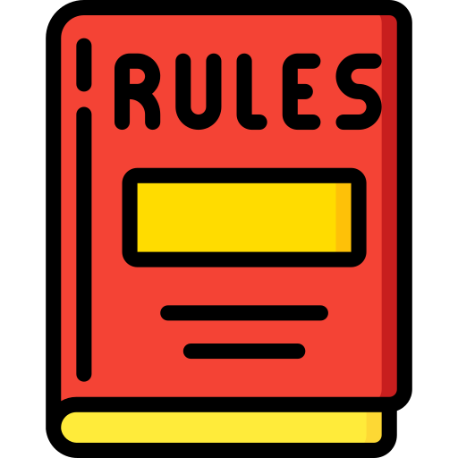

<!-- Improved compatibility of back to top link: See: https://github.com/othneildrew/Best-README-Template/pull/73 -->
<a id="readme-top"></a>

<!-- PROJECT SHIELDS -->
[![Contributors][contributors-shield]][contributors-url]
[![Forks][forks-shield]][forks-url]
[![Stargazers][stars-shield]][stars-url]
[![Issues][issues-shield]][issues-url]
[![MIT License][license-shield]][license-url]
[![LinkedIn][linkedin-shield]][linkedin-url]

<!-- PROJECT LOGO -->
<br />
<div align="center">
  <a href="https://github.com/naravid19/ai-project-rules-generator">
    
  </a>

<h3 align="center">🤖 AI Project Rules Generator</h3>

  <p align="center">
    🚀 Orchestrate professional .cursorrules and AGENTS.md with deterministic JIT skill discovery.
    <br />
    <a href="https://github.com/naravid19/ai-project-rules-generator"><strong>Explore the docs »</strong></a>
    <br />
    <br />
    <a href="https://github.com/naravid19/ai-project-rules-generator">View Demo</a>
    &middot;
    <a href="https://github.com/naravid19/ai-project-rules-generator/issues/new?labels=bug&template=bug-report---.md">Report Bug</a>
    &middot;
    <a href="https://github.com/naravid19/ai-project-rules-generator/issues/new?labels=enhancement&template=feature-request---.md">Request Feature</a>
  </p>
</div>

<!-- TABLE OF CONTENTS -->
<details>
  <summary>Table of Contents</summary>
  <ol>
    <li>
      <a href="#about-the-project">About The Project</a>
      <ul>
        <li><a href="#agentic-alignment-principles">Agentic Alignment Principles</a></li>
        <li><a href="#built-with">Built With</a></li>
      </ul>
    </li>
    <li>
      <a href="#getting-started">Getting Started</a>
      <ul>
        <li><a href="#prerequisites">Prerequisites</a></li>
        <li><a href="#installation">Installation</a></li>
      </ul>
    </li>
    <li><a href="#usage">Usage</a></li>
    <li><a href="#roadmap">Roadmap</a></li>
    <li><a href="#contributing">Contributing</a></li>
    <li><a href="#license">License</a></li>
    <li><a href="#contact">Contact</a></li>
    <li><a href="#acknowledgments">Acknowledgments</a></li>
  </ol>
</details>

<!-- ABOUT THE PROJECT -->
## About The Project

AI Project Rules Generator is a production-grade workflow designed to solve **Context Bloat** and **Agent Drift** in AI-assisted development. By utilizing **Deterministic JIT (Just-In-Time) Retrieval**, it automatically discovers and integrates relevant AI skills from your `.agent/` directory without saturating the LLM's context window.

### **The Flexible Agentic Engine** (v1.9.3)
This generator supports **Dual-Mode Execution**:
*   **Mode A (Enhanced)**: Utilizes parallelized Python scripts (`indexer.py`, `wizard.py`) for high-performance indexing via `ThreadPoolExecutor`.
*   **Mode B (Autonomous)**: 100% self-sufficient via the markdown workflow file—**no installation required**.

### **Agentic Alignment Principles**
We practice what we preach. This tool enforces high-fidelity standards derived from world-class AI engineering methodologies:
*   **[Andrej Karpathy's Skills](https://github.com/forrestchang/andrej-karpathy-skills)**: Prioritizes "Simplicity First", "Surgical Changes", and "Think Before Coding" logic to minimize accidental refactoring.
*   **[Superpowers](https://github.com/obra/superpowers)**: Implements "Verification Before Completion", "Subagent-Driven Development", and "TDD for Documentation" to ensure every AI action is evidence-backed.
*   **Deep Context Savings**: Generates **Pointers** instead of dumping code. AI agents are instructed to `read_file` specific skills only when contextually relevant.

<p align="right">(<a href="#readme-top">back to top</a>)</p>

### Built With

*   [![Python][Python-badge]][Python-url]
*   [![PowerShell][PowerShell-badge]][PowerShell-url]
*   [![Bash][Bash-badge]][Bash-url]
*   [![Markdown][Markdown-badge]][Markdown-url]

<p align="right">(<a href="#readme-top">back to top</a>)</p>

<!-- GETTING STARTED -->
## Getting Started

### Prerequisites
*   An AI assistant (Cursor, Claude Code, Gemini CLI, etc.)
*   A local `.agent/` directory containing skill repositories.

### Installation

**Linux/macOS:**
```sh
curl -sL https://raw.githubusercontent.com/naravid19/ai-project-rules-generator/main/setup.sh | bash
```

**Windows (PowerShell):**
```powershell
irm https://raw.githubusercontent.com/naravid19/ai-project-rules-generator/main/setup.ps1 | iex
```

<p align="right">(<a href="#readme-top">back to top</a>)</p>

<!-- USAGE EXAMPLES -->
## Usage

Simply trigger the command in your AI assistant:
```text
/create-project-rules
```
The AI will autonomously scan your tech stack, match relevant skills using exact-word regex patterns, and generate a tailored `.cursorrules` and `AGENTS.md`.

**Enterprise Features:**
*   **Subagent Orchestration**: Automatically instructs the AI to dispatch specialized subagents for complex tasks.
*   **Systematic Debugging**: Generates audit logs with full stack traces and performance metrics for every generation step.

<p align="right">(<a href="#readme-top">back to top</a>)</p>

<!-- ROADMAP -->
## Roadmap

- [x] Multi-platform Support (9+ Tools)
- [x] Deep Context Savings (Pointer System)
- [x] Parallel Indexing (ThreadPoolExecutor)
- [x] Systematic Debugging (Stack Trace Audit)
- [x] exact-word boundary tagging (\bregex\b)
- [ ] Multi-agent Simulation Environment
- [ ] Web-based Configuration UI

See the [open issues](https://github.com/naravid19/ai-project-rules-generator/issues) for a full list of proposed features.

<p align="right">(<a href="#readme-top">back to top</a>)</p>

<!-- CONTRIBUTING -->
## Contributing

1. Fork the Project
2. Create your Feature Branch (`git checkout -b feature/AmazingFeature`)
3. Commit your Changes (`git commit -m 'Add some AmazingFeature'`)
4. Push to the Branch (`git push origin feature/AmazingFeature`)
5. Open a Pull Request

<p align="right">(<a href="#readme-top">back to top</a>)</p>

<!-- LICENSE -->
## License

Distributed under the MIT License. See `LICENSE` for more information.

<p align="right">(<a href="#readme-top">back to top</a>)</p>

<!-- CONTACT -->
## Contact

naravid19 - [GitHub Profile](https://github.com/naravid19)

Project Link: [https://github.com/naravid19/ai-project-rules-generator](https://github.com/naravid19/ai-project-rules-generator)

<p align="right">(<a href="#readme-top">back to top</a>)</p>

<!-- ACKNOWLEDGMENTS -->
## Acknowledgments

*   [Best-README-Template](https://github.com/othneildrew/Best-README-Template)
*   [Andrej Karpathy's Methodology](https://github.com/forrestchang/andrej-karpathy-skills)
*   [Superpowers Framework](https://github.com/obra/superpowers)
*   [Antigravity Awesome Skills](https://github.com/sickn33/antigravity-awesome-skills)
*   [Claude Scientific Skills](https://github.com/K-Dense-AI/claude-scientific-skills)

<p align="right">(<a href="#readme-top">back to top</a>)</p>

<!-- MARKDOWN LINKS & IMAGES -->
[contributors-shield]: https://img.shields.io/github/contributors/naravid19/ai-project-rules-generator.svg?style=for-the-badge
[contributors-url]: https://github.com/naravid19/ai-project-rules-generator/graphs/contributors
[forks-shield]: https://img.shields.io/github/forks/naravid19/ai-project-rules-generator.svg?style=for-the-badge
[forks-url]: https://github.com/naravid19/ai-project-rules-generator/network/members
[stars-shield]: https://img.shields.io/github/stars/naravid19/ai-project-rules-generator.svg?style=for-the-badge
[stars-url]: https://github.com/naravid19/ai-project-rules-generator/stargazers
[issues-shield]: https://img.shields.io/github/issues/naravid19/ai-project-rules-generator.svg?style=for-the-badge
[issues-url]: https://github.com/naravid19/ai-project-rules-generator/issues
[license-shield]: https://img.shields.io/github/license/naravid19/ai-project-rules-generator.svg?style=for-the-badge
[license-url]: https://github.com/naravid19/ai-project-rules-generator/blob/master/LICENSE
[PowerShell-badge]: https://img.shields.io/badge/PowerShell-5391FE?style=for-the-badge&logo=powershell&logoColor=white
[PowerShell-url]: https://microsoft.com/PowerShell
[Bash-badge]: https://img.shields.io/badge/Bash-4EAA25?style=for-the-badge&logo=gnu-bash&logoColor=white
[Bash-url]: https://www.gnu.org/software/bash/
[Python-badge]: https://img.shields.io/badge/Python-3776AB?style=for-the-badge&logo=python&logoColor=white
[Python-url]: https://www.python.org/
[Markdown-badge]: https://img.shields.io/badge/Markdown-000000?style=for-the-badge&logo=markdown&logoColor=white
[Markdown-url]: https://www.markdownguide.org/
[linkedin-shield]: https://img.shields.io/badge/-LinkedIn-black.svg?style=for-the-badge&logo=linkedin&colorB=555
[linkedin-url]: https://linkedin.com/in/naravidd/